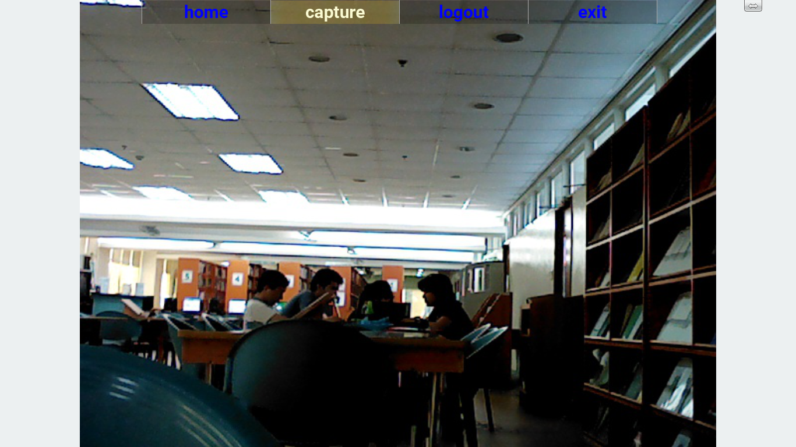

#CameraViewer-v-1-0

###"The Green Screen"

Using an application installed in a computer, the classroom monitoring system called "The Green Screen" will allow the user to access the camera installed in a room in real time. The application will automatically record video at the start of the camera, and will continuously record video clips with a length of 1 minute each until the camera is terminated. This will also allow the user to save a snapshot taken from the camera. The latest 20 snapshots and the last recorded video can be viewed by the user anytime. The user has an option to enable or disable the face detection and motion detection. The user can also choose to enable a guest user that can access only the camera.

#Screenshots

###Login Screen

###Home Screen

###Setting Screen

###Camera Screen

###Snapshot (maximized)
.png)

###Snapshot (minimized)
.png)

###Videoclip (maximized)
.png)

###Videoclip (minimized)
.png)
